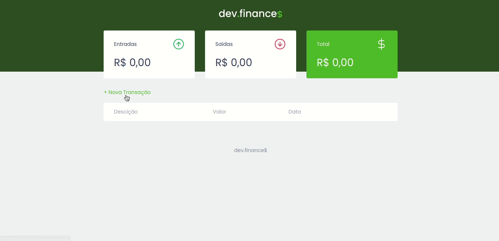
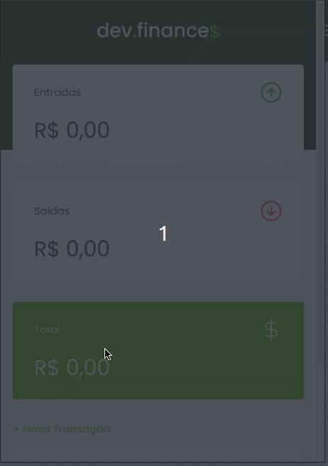

<h1 align="center">Dev Finances</h1>

Dev Finances é um projeto de controle de finanças pessoais.

[Demo](https://personfinances.netlify.app/)

## Tecnologias utilizadas:

- [Javascript](https://developer.mozilla.org/)
- [HTML 5](https://developer.mozilla.org/pt-BR/docs/Web/HTML)
- [CSS 3](https://developer.mozilla.org/pt-BR/docs/Web/CSS)

## Como Utilizar

- Clone o projeto no seu computador
- Abra o index.html no seu browser

Projeto feito com o objetivo de ter uma visão geral e prática dos conceitos de HTML, CSS e JS da maratona Discover da Rocketseat.

